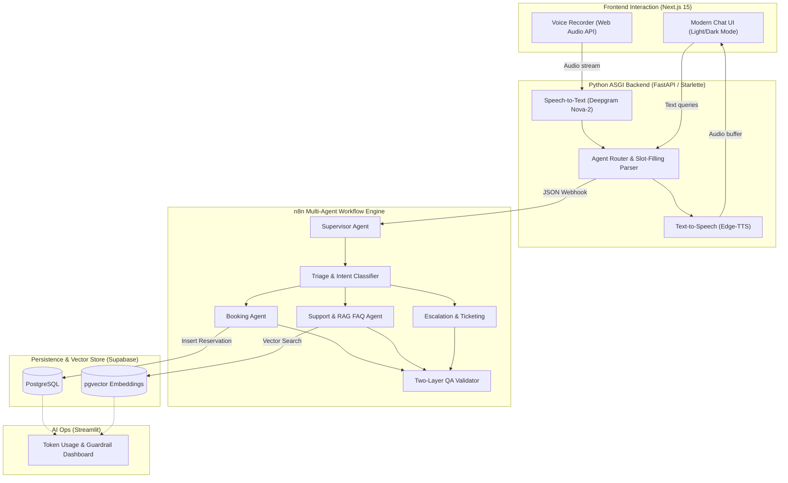

# Nexio24: Multi-Agent Customer Support & Voice Reservation System

[](https://nextjs.org/)
[](https://fastapi.tiangolo.com/)
[](https://n8n.io/)
[](https://supabase.com/)
[](https://deepgram.com/)
[](https://tailwindcss.com/)

> An enterprise-grade, multi-agent AI customer support and reservation platform featuring **low-code workflow orchestration (n8n)**, **real-time voice & web interaction (Next.js + Python FastAPI)**, and **observability analytics (Streamlit)**.

---

## 🌟 Live Demo & Links
- **Live Web Application**: `https://your-agent.vercel.app` *(Replace with your Vercel URL after Step 3)*
- **Backend API**: `https://your-agent-backend.onrender.com` *(Replace with your Render URL after Step 2)*
- **GitHub Repository**: [https://github.com/furqan-ops/Multi-AI-Agents-Customer-Support](https://github.com/furqan-ops/Multi-AI-Agents-Customer-Support)

---

## 🏗️ System Architecture



---

## 🚀 Key Modules & Capabilities

### 1. Low-Code Multi-Agent Orchestration (`project-1/workflows/`)
Contains 7 production-ready n8n workflow definitions that can be imported with 1 click:
- **`supervisor.json`**: Entry-point router directing requests by intent.
- **`triage-agent.json`**: Intent classification and confidence scoring.
- **`booking-agent.json`**: Entity extraction (date, time, party size) and table creation.
- **`support-agent.json`**: Knowledge base retrieval via vector search.
- **`escalation-agent.json`**: Automated human handoff and ticket dispatch.
- **`qa-agent.json`**: 2-layer output validation (deterministic checks + LLM fact-checking).
- **`rag-ingestion.json`**: Automated chunking, embedding, and vector database ingestion.

### 2. Full-Duplex Customer Voice & Chat App (`project-4/`)
- **Modern SaaS UI**: Styled with clean jewel-tone Linear/Stripe aesthetics, theme switcher, responsive layout, and animated agent typing states.
- **Voice-Enabled**: Real-time microphone capture with browser audio normalization, Deepgram Nova-2 STT transcription, and neural voice synthesis.
- **Autonomous Reservation Parser**: Natural language date/time/party slot-filling with automated Supabase booking records.

### 3. AI Ops & Observability Dashboard (`project-3/`)
- Real-time token consumption and cost monitoring.
- Guardrail violation auditing and human escalation queue tracking.

---

## 📂 Repository Structure

```
.
├── project-1/              # n8n Multi-Agent Workflow Engine
│   ├── workflows/          # 7 standalone workflow JSON exports
│   └── notes/              # Architecture & design documentation
│
├── project-3/              # AI Ops & Monitoring Dashboard
│   └── dashboard/app.py    # Streamlit analytics application
│
├── project-4/              # Production Customer Application
│   ├── app/                # Python FastAPI / Starlette backend
│   │   ├── server.py       # ASGI server with STT, TTS & supervisor routes
│   │   └── core/           # Voice I/O, Supabase logging, and configuration
│   ├── frontend/           # Next.js 15 interactive frontend (React 19, Tailwind)
│   ├── requirements.txt    # Python dependencies
│   └── Procfile            # Deployment script for Render / Railway
│
├── .env.example            # Environment variable template
└── README.md
```

---

## 🛠️ Local Development Setup

### 1. Prerequisites
- Node.js 18+ & npm
- Python 3.10+
- Supabase project credentials

### 2. Configure Environment Variables
Copy `.env.example` to `.env` in the root:
```bash
cp .env.example .env
```
Fill in your `SUPABASE_URL`, `SUPABASE_SECRET_KEY`, and `DEEPGRAM_API_KEY`.

### 3. Start the Python Backend
```bash
cd project-4
python -m venv .venv
# On Windows:
.\.venv\Scripts\activate
# On Linux/macOS:
source .venv/bin/activate

pip install -r requirements.txt
python -m app.server
```
*Backend runs on `http://localhost:5000`.*

### 4. Start the Next.js Frontend
In a new terminal:
```bash
cd project-4/frontend
npm install
npm run dev
```
*Frontend runs on `http://localhost:3000`.*

---

## 🚢 Production Deployment Guide

### Deploying Backend on Render (Free Tier)
1. Fork or push this repository to your GitHub.
2. Sign in to [Render](https://render.com) and click **New + Web Service**.
3. Connect your repository and configure:
   - **Root Directory**: `project-4`
   - **Runtime**: Python 3
   - **Build Command**: `pip install -r requirements.txt`
   - **Start Command**: `uvicorn app.server:app --host 0.0.0.0 --port $PORT`
4. Add Environment Variables:
   - `SUPABASE_URL`
   - `SUPABASE_SECRET_KEY`
   - `DEEPGRAM_API_KEY`
5. Click **Create Web Service** to receive your live backend URL (e.g. `https://my-backend.onrender.com`).

### Deploying Frontend on Vercel (Free Tier)
1. Sign in to [Vercel](https://vercel.com) and click **Add New Project**.
2. Select your repository and configure:
   - **Root Directory**: `project-4/frontend`
   - **Framework Preset**: Next.js
3. In **Environment Variables**, add:
   - `NEXT_PUBLIC_FLASK_URL`: `https://my-backend.onrender.com` *(Your Render backend URL)*
4. Click **Deploy**. Your app will be live with free global CDN and SSL!

---

## 📄 License
This project is licensed under the MIT License.
